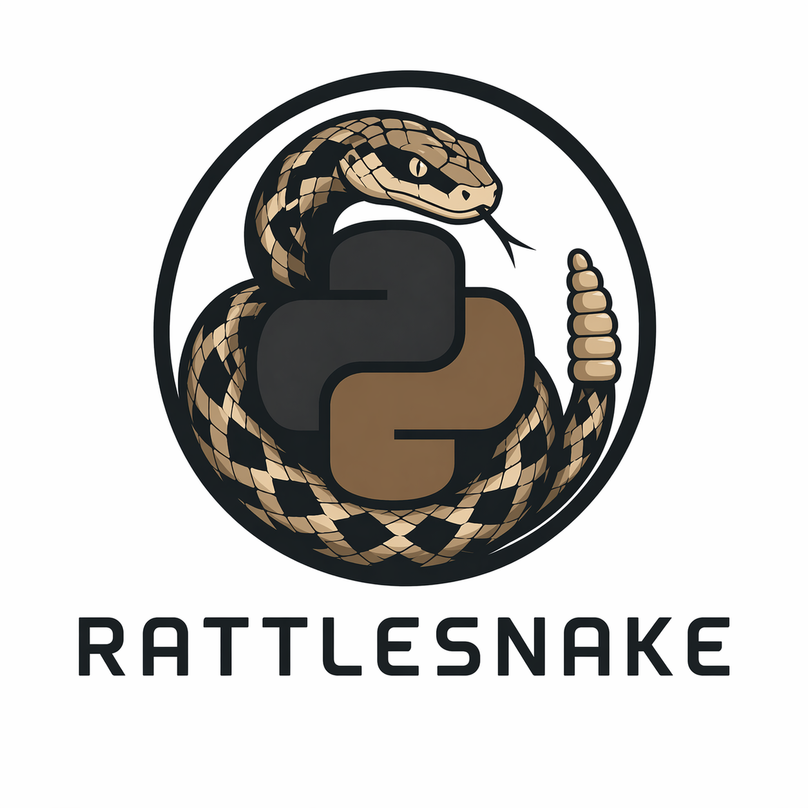

# Rattlesnake



**Learn Python by fixing code, running tests, and getting immediate feedback.**

Rattlesnake is an interactive exercise runner for learning Python from basic
syntax through advanced language features. It is a fork of
[Rustlings](https://github.com/rust-lang/rustlings) that retains the fast Rust
CLI, file watcher, progress tracking, and terminal interface while replacing
the curriculum and validation pipeline with Python.

> [!NOTE]
> Rattlesnake is under active development. The curriculum and installation
> experience may change before the first stable release.

## What You Get

- **32 hands-on exercises** with matching reference solutions
- A gentle 10-exercise introduction for learners new to Python
- Automatic reruns whenever you save the current exercise
- Built-in hints, progress tracking, exercise reset, and check-all commands
- Validation powered by [`uv`](https://docs.astral.sh/uv/),
  [`pytest`](https://pytest.org/), [`Ruff`](https://docs.astral.sh/ruff/), and
  [`ty`](https://docs.astral.sh/ty/)
- Intermediate and advanced topics including decorators, context managers,
  generators, concurrency, async programming, protocols, and metaclasses

## Prerequisites

To build and run Rattlesnake from source, install:

- [Rust](https://www.rust-lang.org/tools/install) 1.88 or newer
- [`uv`](https://docs.astral.sh/uv/getting-started/installation/)

`uv` manages the Python 3.12 environment and exercise dependencies created by
`rattlesnake init`.

## Quick Start

Install the CLI from source:

```bash
git clone https://github.com/papadavis47/rattlesnake.git
cargo install --path rattlesnake
```

From the directory where you want to keep your exercises, initialize a course:

```bash
rattlesnake init
cd rattlesnake
rattlesnake
```

Rattlesnake opens the first pending exercise and watches it for changes. Follow
the `# TODO` instructions, save the file, and return to the terminal to see the
result. When an exercise passes, press `n` to continue or `h` for a hint.

## Curriculum

Exercises run in the order defined by
[`rustlings-macros/info.toml`](rustlings-macros/info.toml):

| Level | Topics |
| --- | --- |
| Beginner | Output, variables, arithmetic, strings, conditionals, lists, loops, functions, dictionaries, and classes |
| Core Python | Type hints, data structures, comprehensions, and decorators |
| Object model | OOP, properties, descriptors, metaclasses, protocols, and abstract base classes |
| Control and resources | Context managers, iterators, generators, and error handling |
| Applied Python | Concurrency, `asyncio`, pytest, closures, `functools`, and structural pattern matching |

Each exercise lives in `exercises/` and has a completed counterpart in
`solutions/`.

## Commands

Run these commands from an initialized exercise directory:

| Command | Purpose |
| --- | --- |
| `rattlesnake` | Start interactive watch mode |
| `rattlesnake run [name]` | Run an exercise, or the next pending exercise |
| `rattlesnake hint [name]` | Show an exercise hint |
| `rattlesnake reset <name>` | Restore an exercise to its original state |
| `rattlesnake check-all` | Recheck every exercise and update progress |

Use `rattlesnake --help` to see editor and manual-run options.

## How Exercises Are Checked

Each exercise can enable or disable individual validation stages in
`rustlings-macros/info.toml`:

```text
uv run python exercise.py
        ↓
uv run pytest exercise.py
        ↓
uv run ruff check exercise.py
        ↓
uv run ty check exercise.py
```

The first stage always verifies that the file runs. Tests, linting, and type
checking are configured per exercise.

## Developing Rattlesnake

Build the Rust CLI:

```bash
cargo check
cargo test
```

Exercise metadata, ordering, hints, and validation flags live in
`rustlings-macros/info.toml`. New exercises require:

1. An unsolved Python file under `exercises/<section>/`
2. A matching completed file under `solutions/<section>/`
3. An `[[exercises]]` entry in `rustlings-macros/info.toml`
4. At least one `# TODO` instruction and an inline hint

See [`CONTRIBUTING.md`](CONTRIBUTING.md) for the repository contribution
workflow.

## Brand Assets

Project logo assets are available in [`images/`](images/) in PNG, SVG, vector,
traced, and ASCII formats. Use `images/rattlesnake-logo.png` as the default
project mark unless a different format is required.

## Acknowledgements

Rattlesnake is built on the excellent
[Rustlings](https://github.com/rust-lang/rustlings) project and preserves much
of its CLI architecture and interactive learning experience.

## License

Rattlesnake is available under the [MIT License](LICENSE).
